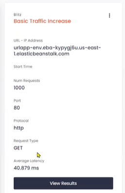
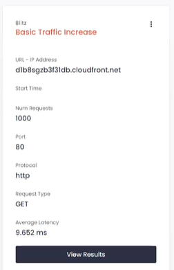
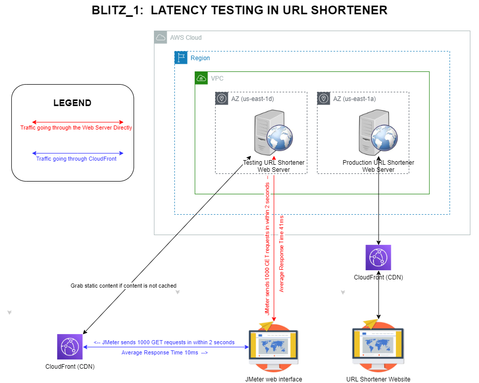

# TEST LATENCY IN URL SHORTENER IN TEST ENVIRONMENT

September 29, 2023

By:  Annie V Lam - Kura Labs

# Background

Nike emailed us about the URL Shortener.  In Nike's email, Nike mentioned customers are complaining about how long it takes to load their web pages.  Nike would like us to reduce the amount of latency customers are experiencing.  

## Troubleshooting

For testing, in order not to crash the production web server, we created a new web server.  This test environment is in the same region, the same VPC, but different availability zones (AZ) as the production environment.  As the test server is in the same region as the production server, just in different buildings, the difference in latency if there is any, should be immaterial.

Our third-party application, Codon, allows us to test for average latency.  We used Codon to send a thousand GET requests within 2 seconds to the test server to see what the average latency is. The result is that our URL Shortener website's average response time (latency) is 40.879 ms, which is much longer than what we would like.  

## Possible Resolution

Placing a Content Delivery Network (CDN) most likely will reduce the latency time since the web content will be cached in the CDN.  As our whole infrastructure is on the AWS platform, we decided to use AWS CDN service, CloudFront.  After creating the CloudFront CDN distribution, we used Codon to test latency with the same parameters, 1000 GET requests in a matter of 2 seconds.  The CDN reduced latency to 9.652 ms.

## Conclusion

Adding a CDN for static content helps with latency.  In our case with the URL Shortener, latency went from 41ms to 10ms, which is a 75% increase in efficiency rate.  As the CDN helped with latency, we also added AWS CloudFront to our production web server.  

